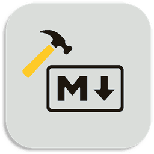
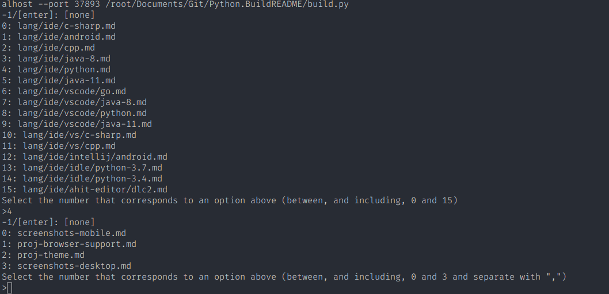
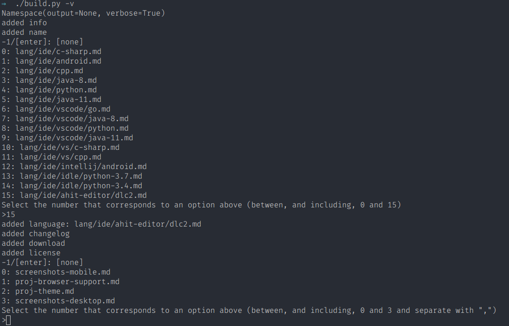
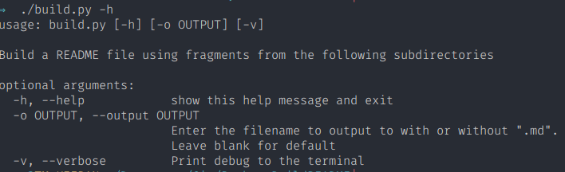

# Python.BuildREADME



A repository consisting of standard readmes providing details of how to run projects written in a range of programming languages


Build a README file using fragments from the following subdirectories

req
core
lang
support
screenshots
extras

# Example Use 

Create the template for this markdown file (excludes Example Use and Help)
```shell
py build.py -o README -l ide/idle/python-3.7 -s limited -i desktop -e proj-icon
```

# Help

Help for build.py - Author Kieran W
2019-05-06

Note: where .md is shown as a file extension, this can be omitted 

## -n --nocore 
Option to determine if core fragments are added to the output. Recommended to omit 
this.

Core modules are 
+---core
|       proj-desc.md
|       proj-down.md
|       proj-lice.md
|       proj-name.md

## -o --output
Enter the filename to output to with or without '.md'. Leave blank for default

## -l --lang
Enter the programming language to use in the form ide/language or language.
Use the latter for generalized readme.
Leave blank for none 

Options are:

+---lang
|   |   android.md
|   |   arm-v7.md
|   |   c-sharp.md
|   |   cpp.md
|   |   go.md
|   |   haskell.md
|   |   java-8.md
|   |   java.md
|   |   minix-c.md
|   |
|   \---ide
|       +---android-studio
|       |       android.md
|       |
|       +---dcoder
|       |       go-1.10.4.md
|       |       go-1.6.md
|       |       haskell-7.6.md
|       |
|       +---eclipse
|       |       java.md
|       |
|       +---idle
|       |       python-3.4.md
|       |       python-3.7.md
|       |
|       +---vs
|       |       c-sharp.md
|       |       cpp.md
|       |       java-8.md
|       |
|       \---vs-code

## -s --support
Enter the type of support to use. Leave blank for none 

\---support
        full.md
        limited.md
        none.md

## -i --images --screenshots
Enter the type of screenshots to use

+---screenshots
|       desktop-mobile.md
|       desktop.md
|       mobile.md

## -e --extras
Enter any extras. Use -e for each extra

+---extras
|       proj-browser-support.md
|       proj-icon.md
|       proj-theme.md

eg. for a pwa with an icon and themes, you may want to add the options
-o proj-browser-support -o proj-icon -o proj-theme

## -v --verbose 
Print debug to the terminal

## -p --param 
Specify parameters in the form -p param=value eg.
-p proj-name="my fantastic project"

## -a --advanced-help
Show the advanced help dialogue 

# Download
## Clone
### Using The Command Line 
1. Press the Clone or download button in the top right
2. Copy the URL (link)
3. Open the command line and change directory to where you wish to clone to
4. Type 'git clone' followed by URL in step 2
```bash
$ git clone https://github.com/[user-name]/[repository]
```

More information can be found at https://help.github.com/en/articles/cloning-a-repository 

### Using GitHub Desktop
1. Press the Clone or download button in the top right
2. Click open in desktop
3. Choose the path for where you want and click Clone

More information can be found at https://help.github.com/en/desktop/contributing-to-projects/cloning-a-repository-from-github-to-github-desktop 

## Download Zip File

1. Download this GitHub repository
2. Extract the zip archive
3. Copy/ move to the desired location

# Language information 
## Built for
This program has been written for Python 3 and has been tested with 
Python version 3.7.0 https://www.python.org/downloads/release/python-370/ 
on a Windows 10 PC. 
## Other versions
To install Python, go to https://www.python.org/ and download the latest version. 
# How to run
1. Open the .py file in IDLE
2. Run by pressing F5 or by selecting Run> Run Module


# Licence 
MIT License
Copyright (c) Kieran W
(See the [LICENSE](/LICENSE.md) for more information.)

<!--
TODO: Add screenshots to readme-assets/screenshots/desktop/ named screenshot-[number].png
-->
# Screenshots 

## Desktop 
|Screenshots|
|:-:|
|  |
|  |
|  | 


# Limited Support
Expect this project to be supported for approximately 6 months (for bug-fixes only).
 Note that this is not guaranteed. Create an issue for bugs
 (as this project is carried out in spare time, you may have 
to wait for a few days)


