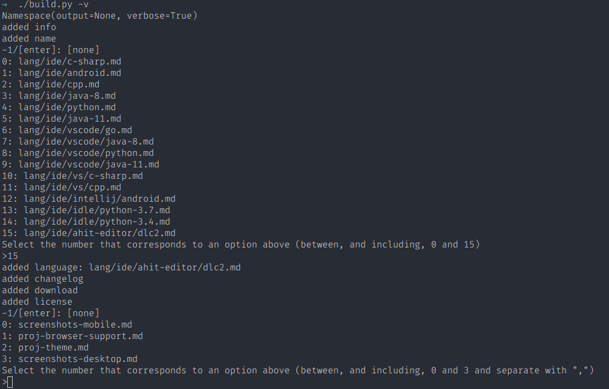

<!--
Note that this is a template, you will need to make changes and complete TODOs

Optional: comment out the code below 
-->

<!--
Built with md.README/build.py by Kieran W.
Find out more at: https://github.com/FredHappyface/md.README

-->

<!--
TODO: Complete proj-name 
-->

# [proj-name]


<!--
TODO: Write project description
-->
TODO: Write project description


<!--

-->
# Download
## Clone
### Using The Command Line 
1. Press the Clone or download button in the top right
2. Copy the URL (link)
3. Open the command line and change directory to where you wish to clone to
4. Type 'git clone' followed by URL in step 2
```bash
$ git clone https://github.com/[user-name]/[repository]
```

More information can be found at https://help.github.com/en/articles/cloning-a-repository 

### Using GitHub Desktop
1. Press the Clone or download button in the top right
2. Click open in desktop
3. Choose the path for where you want and click Clone

More information can be found at https://help.github.com/en/desktop/contributing-to-projects/cloning-a-repository-from-github-to-github-desktop 

## Download Zip File

1. Download this GitHub repository
2. Extract the zip archive
3. Copy/ move to the desired location


<!--
TODO: Complete proj-lice and proj-author (specify the licence used and the author of the project)
-->
# Licence 
[proj-lice] License
Copyright (c) [proj-author]
(See the [LICENSE](/LICENSE.md) for more information.)


# Browser Support 

## Supported 
This PWA is optimised for the following browsers and has been tested on them:

|Google Chrome|Chromium Based Browsers|Safari|
|:-:|:-:|:-:|
|  |  |  |

## Supported 
This PWA should function on these browsers but some elements may look odd:

|Firefox|Microsoft Edge|
|:-:|:-:|
|  |  |

## Supported 
This PWA is not supported on these browsers, functionality and visuals may not work as expected:

|Internet Explorer|TOR Browser|Other Browsers|
|:-:|:-:|:-:|
|  |  |  |


<!--
TODO: Add screenshots to readme-assets/screenshots/desktop/ named screenshot-[number].png
and readme-assets/screenshots/mobile/ named screenshot-[number].png
-->

# Screenshots 

## Desktop 
|Screenshots|
|:-:|
|  |
|  |
|  | 


## Mobile 
|Screenshots| |
|:-:|:-:|
|  |  |
|  |  |


## Themes 
|Light|Dark|Black|
|:-:|:-:|:-:|
|  |  |  |


# Limited Support
Expect this project to be supported for approximately 6 months (for bug-fixes only).
 Note that this is not guaranteed. Create an issue for bugs
 (as this project is carried out in spare time, you may have 
to wait for a few days)


